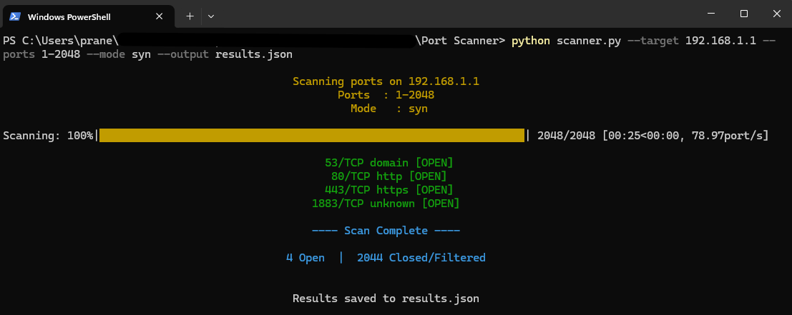

# Python Port Scanner

A lightweight, multithreaded CLI TCP port scanner with SYN stealth scan, banner grabbing, and JSON export. Built with Python and Scapy.

---

## Features
* Connect Scan: Full TCP handshake using sockets with banner grabbing and service detection
* SYN Scan: Half-open scan using Scapy, never completes the TCP handshake, reducing noise for stealthy scans
* Multithreaded: ThreadPoolExecutor for fast concurrent scanning in connect mode
* Banner Grabbing: Attempts to retrieve service banners on open ports
* Service Detection: Resolves common port numbers to service names
* JSON Export: Save scan results to a JSON file
* Clean Output: Results are shown in an organized, coloured format to the terminal including a live progress bar

--- 

## Demo



---

## Requirements
- Python 3.8+
- [Scapy](https://scapy.net/) — for SYN scan mode
- [tqdm](https://github.com/tqdm/tqdm) — progress bar
- [colorama](https://github.com/tartley/colorama) — colored terminal output

Install dependencies:
 
```bash
pip install scapy tqdm colorama
```

---

## OS Notes

| Feature | Linux | macOS | Windows |
|---|---|---|---|
| Connect scan | ✅ No privileges needed | ✅ No privileges needed | ✅ No privileges needed |
| SYN scan | ✅ Requires `sudo` | ✅ Requires `sudo` | ✅ Requires Administrator |
 
**Linux / macOS:** Run SYN scan with `sudo python scanner.py ...`
 
**macOS:** `libpcap` is required by Scapy. It comes pre-installed on most macOS versions. If Scapy throws an error, install it via Homebrew: `brew install libpcap`
 
**Windows:** Run SYN scan from an Administrator terminal. Scapy on Windows also requires [Npcap](https://npcap.com/) to be installed.

---

## Usage
 
```
python scanner.py --target <IP or hostname> --ports <start-end> [options]
```

### Arguments
 
| Argument | Required | Description |
|---|---|---|
| `--target` | Yes | Target IP address or hostname |
| `--ports` | Yes | Port range in format `START-END` (e.g. `1-1024`) |
| `--mode` | No | Scan mode: `connect` (default) or `syn` |
| `--threads` | No | Number of threads for connect mode (default: 100) |
| `--output` | No | Save JSON output to filename (e.g. `results.json`) |

### Examples
 
**Connect scan (default):**
```bash
python scanner.py --target 127.0.0.1 --ports 1-1024
```
 
**SYN stealth scan:**
```bash
sudo python scanner.py --target 192.168.1.1 --ports 1-1024 --mode syn
```
 
**Save results to JSON:**
```bash
python scanner.py --target 127.0.0.1 --ports 1-1024 --output results.json
```
 
**Custom thread count:**
```bash
python scanner.py --target 192.168.1.1 --ports 1-65535 --threads 200
```
 
---
 
## Output
 
### Terminal
```
Scanning ports on 192.168.1.1
Ports  : 1-2048
Mode   : syn

Scanning: 100%|████████████████████████| 2048/2048 [00:25<00:00, 78.00port/s]

53/TCP    domain      [OPEN]
80/TCP    http        [OPEN]
443/TCP   https       [OPEN]

---- Scan Complete ----
3 Open  |  2045 Closed/Filtered
```
 
### JSON (`--output results.json`)
```json
{
  "target": "192.168.1.1",
  "ports": "1-2048",
  "mode": "syn",
  "timestamp": "2025-01-15T14:32:10.123456",
  "open_ports": [
    { "port": 53,  "service": "domain", "banner": "" },
    { "port": 80,  "service": "http",   "banner": "" },
    { "port": 443, "service": "https",  "banner": "" }
  ]
}
```
 
---
 
## How It Works
 
### Connect Scan
Attempts a full TCP three-way handshake on each port using Python's `socket` library. If the connection succeeds, the port is open. Runs concurrently using `ThreadPoolExecutor` for speed. Attempts banner grabbing by sending an HTTP HEAD request and reading the response.
 
### SYN Scan
Sends a raw TCP SYN packet using Scapy and inspects the response:
- **SYN-ACK** → port is open, responds with RST to avoid completing the handshake
- **RST-ACK** → port is closed
- **No response** → port is filtered
  
Port order is randomized to reduce detection likelihood. Requires root/Administrator privileges for raw socket access.
 
---
 
## Legal Disclaimer
 
This port scanner is intended for authorized security testing and educational purposes only. You are solely responsible for ensuring you have explicit permission from the system owner before scanning any network, host, or device. Unauthorized port scanning may violate local, state, federal, or international laws. The author of this tool accepts no liability for any misuse, damage, or legal consequences arising from its use. By using this software, you agree that you will only scan systems you own or have appropriate authorization to test.
Use responsibly. Hack ethically.
 
---


